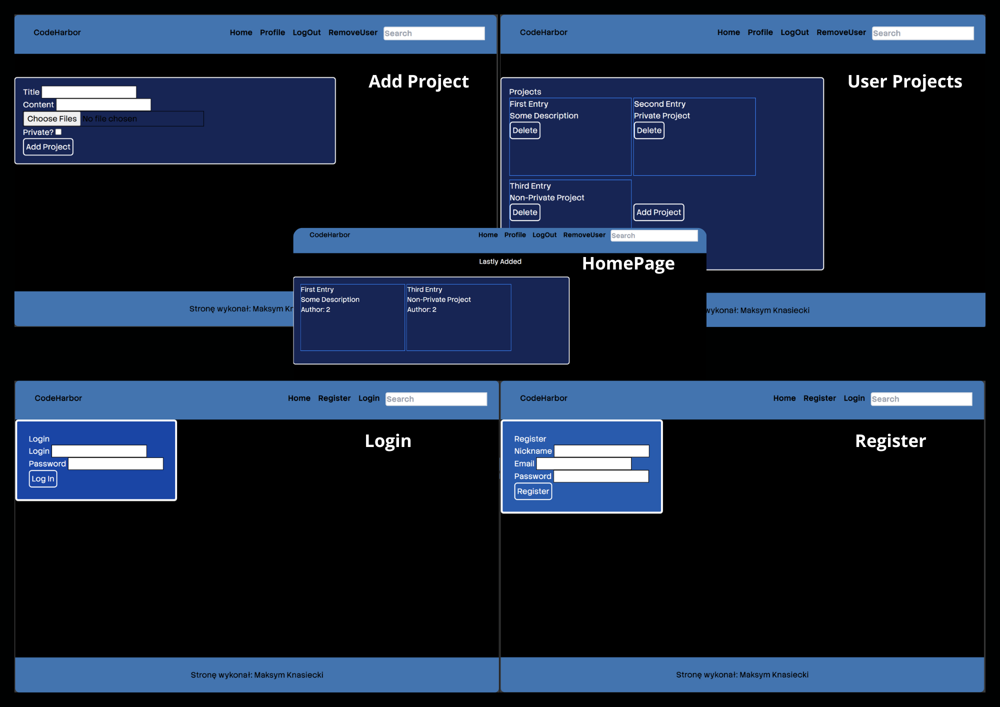

# CodeHarbor

**CodeHarbor** is a production-grade REST API application inspired by GitHub's core functionalities. It demonstrates advanced backend engineering, robust user management, session handling, and project/repository storage — supported by a clean, minimal frontend interface.

## User Handling
 - Endpoint to register a user
 - Users data stored in SQLite database.
 - To store and restore sessions I used JWT technology with web cookies.
 - LogOut functionality that revokes access to JWT.
 - Deleting user from database (soft deletion)

## Storing Projects
 - Ability to add projects tied to user account
 - Setting whenever they are meant to be public or kept private
 - Deleting projects (permament delete)
 - [ ] Changing it's privacy state

## Searching
 - Searching though public projects and returning those which contains provided keyword in titles or description.

## Design Showcase

 

### Setting Up
 - Download DB Browser for SQLIte (or any other if you change DB Engine)
     * [DB Browser](https://sqlitebrowser.org/)  
 - Python setup:
     - Python 3.11.9 or later
     - Create Virtual Environment
    ```py
        python -m venv .venv
        .venv\Scripts\activate 
    ```
    
     - Install Dependencies
    ```py
        pip install -r requirements.txt 
    ```
    
 - TailwindCSS setup:
     - Version v3 - due to CLI tools not available in v4
     <details close>
       <summary>Installing and setting up PostCSS module (Click Me)</summary>

      ## Download Node.js
      * [Node.js](https://nodejs.org/en/download)
      - Remember to run all of these commands in your projects' root folder!s
        - Provide CMD with these commands:
          - Initialize nmp:
          ```cmd
          npm init -y
          ```
          - Installing correct version of TailwindCSS and PostCSS module
          ```cmd
          npm install -D tailwindcss@3.4.4 postcss@8.4.38 autoprefixer@10.4.19
          ```
          <!-- this should be done \/ -->
          - Create Tailwind config files:
          ```cmd 
          npx tailwindcss init
          ```
            - Depending on how you mount your static folders you will want to change input and out file path:
            ```cmd 
            "scripts": {
                "build-css": "tailwindcss -i ./static/src/input.css -o ./static/css/output.css --watch --verbose"
            },
            ```
          - Build your CSS file:
          ```cmd 
          npm run build-css
          ```
          This command will work until you hit CTRL + C, but keep it running when designing your html files.
    </details>
 - Launch your server live:
    - With active Virtual Environment (venv):
    ```py 
    cd app/python
    ```
    - Go live with one of these command prompts:
    ```py 
    fastapi dev
    ```
    ```py 
    uvicorn main:app --host 127.0.0.1 --port 8000
    ```
    - Server available on localhost IP adress with suffix ":8000" 
    ```py
    127.0.0.1:8000
    ```

### TechStack
 - DataBase Engine: SQLite
 - Backend: Python, FastAPI, SQLAlchemy
 - Frontend: HTML, TailwindCSS